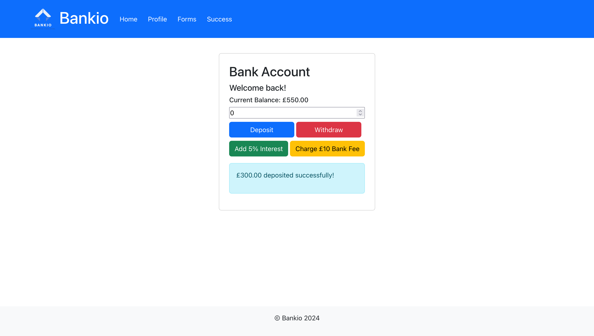

# React Interest Calculator

This is a simple banking application built with React and Bootstrap. It allows users to deposit and withdraw money, calculate interest, and charge bank fees on their account balance.

## Features
- Display current bank balance.
- Deposit money into the bank.
- Withdraw money from the bank.
- Add interest to the account.
- Charge bank fees.
- Display transaction messages.

## Live Demo

[Live Demo](https://react-interest-calculator-six.vercel.app/)

## Demo



## Installation

To run this project locally, follow these steps:

1. Clone the repository:
   ```bash
   git clone https://github.com/Damilordz/react-interest-calculator.git
   ```
2. Navigate to the project directory:
   ```bash
   cd react-interest-calculator
   ```
3. Install dependencies:
   ```bash
   npm install
   ```
4. Start the development server:
   ```bash
   npm start
   ```
The app will open in your default browser at `http://localhost:3000`.

## Technologies Used

- React
- Bootstrap
- JavaScript

## Contributing

Contributions are welcome! If you find any issues or have suggestions for improvements, please open an issue or submit a pull request.


## Acknowledgments

- [React Documentation](https://react.dev/learn)
- [Bootstrap Documentation](https://getbootstrap.com/docs/)
